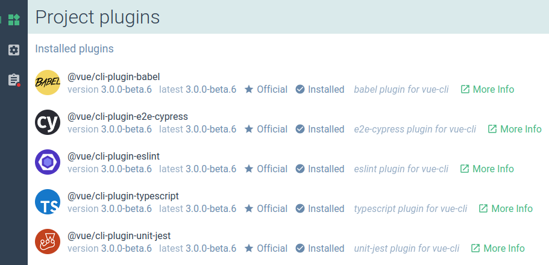
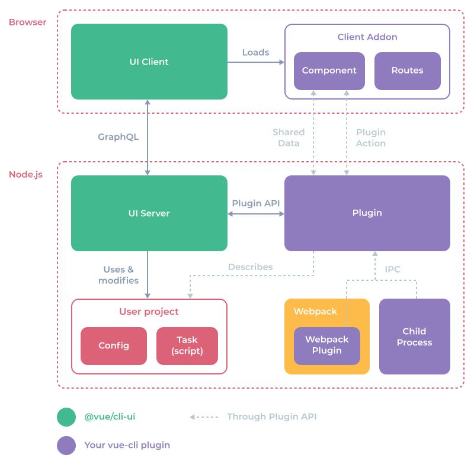
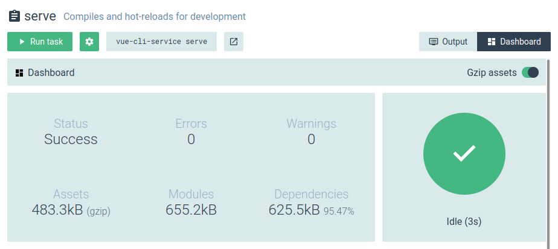

# Plugin UI Development Guide

This guide will walk you through the development of cli-ui specific features for your vue-cli plugins.

- [Plugin Info](#plugin-info)
  - [Logo](#logo)
  - [Discoverability](#discoverability)
- [UI API](#ui-api)
  - [UI files](#ui-files)
  - [Dev mode](#dev-mode)
  - [Project configurations](#project-configurations)
  - [Project tasks](#project-tasks)
  - [Client addon](#client-addon)
  - [Custom views](#custom-views)
  - [Shared data](#shared-data)
  - [Plugin actions](#plugin-actions)
  - [Inter-process communication (IPC)](#inter-process-communication-ipc)
  - [Local storage](#local-storage)
  - [Localization](#localization)
  - [Hooks](#hooks)
  - [Public static files](#public-static-files)

## Plugin Info

When used in the UI, your plugin can show additional information to make it more discoverable and recognizable.

### Logo

You can put a `logo.png` file in the root directory of the folder that will be published on npm. It will be displayed in several places:
 - When searching for a plugin to install
 - In the installed plugin list



The logo should be a square non-transparent image (ideally 84x84).

### Discoverability

For better discoverability when a user searches for your plugin, put keywords describing your plugin in the `description` field of the plugin `package.json` file.

Example:

```json
{
  "name": "vue-cli-plugin-apollo",
  "version": "0.7.7",
  "description": "vue-cli 3 plugin to add Apollo and GraphQL"
}
```

You should add the url to the plugin website or repository in the `homepage` or `repository` field so that a 'More info' button will be displayed in your plugin description:

```json
{
  "repository": {
    "type": "git",
    "url": "git+https://github.com/Akryum/vue-cli-plugin-apollo.git"
  },
  "homepage": "https://github.com/Akryum/vue-cli-plugin-apollo#readme"
}
```


## UI API

The cli-ui exposes an API that allows augmenting the project configurations and tasks, as well as sharing data and communicating with other processes.



### UI files

Inside each installed vue-cli plugins, the cli-ui will try to load an optional `ui.js` file in the root folder of the plugin. It will also try to load a `vue-cli-ui.js` file in the user project root so the UI can be manually extended on a per-project basis (also useful to quickly prototype a plugin).

The file should export a function which gets the api object as argument:

```js
module.exports = api => {
  // Use the API here...
}
```

**⚠️ The files will be reloaded when feetching the plugin list in the 'Project plugins' view. To apply changes, click on the 'Project plugins' button in the navigation sidebar on the left.**

### Dev mode

While building your plugin, you may want to run the cli-ui in Dev mode, so it will output useful logs to you:

```
vue ui --dev
```

### Project configurations


You can add a project configuration with the `api.describeConfig` method.

First you need to pass some informations:

```js
api.describeConfig({
  // Unique ID for the config
  id: 'eslintrc',
  // Displayed name
  name: 'ESLint configuration',
  // Shown below the name
  description: 'Error checking & Code quality',
  // "More info" link
  link: 'https://eslint.org'
})
```

Specify an icon with either a file type (like `'json'`) or a file name (like `.babelrc` to get the babel icon). This is powered by file-icons.

```js
api.describeConfig({
  /* ... */
  // Icon generated using file-icons
  icon: '.eslintrc.json'
})
```

Then you can specify which files will be read when loading the configuration and then written to:

```js
api.describeConfig({
  /* ... */
  // All possible files for this config
  files: {
    json: ['.eslintrc', '.eslintrc.json'],
    js: ['.eslintrc.js'],
    // Will read from `package.json`
    package: 'eslintConfig'
  },
})
```

Supported types: `json`, `yaml`, `js`, `package`.

Use the `onRead` hook to return a list of prompts to be displayed for the configuration:

```js
api.describeConfig({
  /* ... */
  onRead: ({ data, cwd }) => ({
    prompts: [
      // Prompt objects
    ]
  })
})
```

The prompt objects must be valid [inquirer](https://github.com/SBoudrias/Inquirer.js) prompts with the following additional fields (which are optional):

```js
{
  /* ... */
  // Used to group the prompts into sections
  group: 'Strongly recommended',
  // Additional description
  description: 'Enforce attribute naming style in template (`my-prop` or `myProp`)',
  // "More info" link
  link: 'https://github.com/vuejs/eslint-plugin-vue/blob/master/docs/rules/attribute-hyphenation.md',
}
```

Supported inquirer types: `checkbox`, `confirm`, `input`, `password`, `list`, `rawlist`.

Use the `onWrite` hook to write the data to the configuration file (or execute any node code):

```js
api.describeConfig({
  /* ... */
  onWrite: ({ prompts, answers, data, file, cwd, api }) => {
    // ...
  }
})
```

Arguments:

- `prompts`: current prompts runtime objects
- `answers`: answers data from the user inputs
- `data`: read-only initial data read from the file
- `file`: descriptor of the found file (`{ type: 'json', path: '...' }`)
- `cwd`: current working directory
- `api`: onWrite API

Prompts runtime objects:

```js
{
  id: data.name,
  type: data.type,
  name: data.short || null,
  message: data.message,
  group: data.group || null,
  description: data.description || null,
  link: data.link || null,
  choices: null,
  visible: true,
  enabled: true,
  // Current value (not filtered)
  value: null,
  // true if changed by user
  valueChanged: false,
  error: null,
  // Original inquirer prompt object
  raw: data
}
```

onWrite API:

- `assignData(newData)`: use `Object.assign` to update the config data before writing.
- `setData(newData)`: each key of `newData` will be deeply set (or removed if `undefined` value) to the config data before writing.
- `async getAnswer(id, mapper)`: retrieve answer for a given prompt id and map it through `mapper` function if provide (for example `JSON.parse`).

### Project tasks


Tasks are generated from the `scripts` field in the project `package.json` file.

You can 'augment' the tasks with additional info and hooks thanks to the `api.describeTask` method:

```js
api.describeTask({
  // RegExp executed on script commands to select which task will be described here
  match: /vue-cli-service serve/,
  description: 'Compiles and hot-reloads for development',
  // "More info" link
  link: 'https://github.com/vuejs/vue-cli/blob/dev/docs/cli-service.md#serve',
  // Optional parameters (inquirer prompts)
  prompts: [
    {
      name: 'open',
      type: 'confirm',
      default: false,
      description: 'Open browser on server start'
    },
    {
      name: 'mode',
      type: 'list',
      default: 'development',
      choices: [
        {
          name: 'development',
          value: 'development'
        },
        {
          name: 'production',
          value: 'production'
        },
        {
          name: 'test',
          value: 'test'
        }
      ],
      description: 'Specify env mode'
    }
  ],
  // Hooks
  // Modify arguments here
  onBeforeRun: ({ answers, args }) => {
    // Args
    if (answers.open) args.push('--open')
    if (answers.mode) args.push('--mode', answers.mode)
    args.push('--dashboard')
  },
  // Immediatly after running the task
  onRun: ({ args, child, cwd }) => {
    // child: node child process
    // cwd: process working directory
  },
  onExit: ({ args, child, cwd, code, signal }) => {
    // code: exit code
    // signal: kill signal used if any
  },
  // Additional views (for example the webpack dashboard)
  // By default, there is the 'output' view which displays the terminal output
  views: [
    {
      // Unique ID
      id: 'vue-webpack-dashboard-client-addon',
      // Button label
      label: 'Dashboard',
      // Button icon
      icon: 'dashboard',
      // Dynamic component to load (see 'Client addon' section below)
      component: 'vue-webpack-dashboard'
    }
  ],
  // Default selected view when displaying the task details (by default it's the output)
  defaultView: 'vue-webpack-dashboard-client-addon'
})
```

### Client addon

A Client addon is a JS bundle which is dynamically loaded into the cli-ui. It is useful to load custom components and routes.

#### Create a client addon

The recommended way to create a Client addon is by creating a new project using vue-cli 3. You can either do this in a subfolder of your plugin or in a different npm package.

Then add a `vue.config.js` file with the following content:

```js
const { clientAddonConfig } = require('@vue/cli-ui')

module.exports = {
  ...clientAddonConfig({
    id: '<client-addon-id>',
    // Development port (default 8042)
    port: 8042
  })
}
```

The `clientAddonConfig` method will generate the needed vue-cli configuration. Among other things, it disables CSS extraction and outputs the code to `./dist/index.js` in the client addon folder.

**⚠️ Don't forget to replace `<client-addon-id>` in the `id` field with the id of your new client addon!**

Then modify the `.eslintrc.json` file to add some allowed global objects:

```json
{
  // ...
  "globals": {
    "ClientAddonApi": false,
    "mapSharedData": false,
    "Vue": false
  }
}
```

You can now run the `serve` script in development and the `build` one when you are ready to publish your plugin.

#### ClientAddonApi

Open the `main.js` file in the client addon sources and remove all the code.

**⚠️ Don't import Vue in the client addon sources, use the global `Vue` object from the browser `window`.**

Here is an example of code for `main.js`:

```js
import VueProgress from 'vue-progress-path'
import WebpackDashboard from './components/WebpackDashboard.vue'
import TestView from './components/TestView.vue'

// You can install additional vue plugins
// using the global 'Vue' variable
Vue.use(VueProgress, {
  defaultShape: 'circle'
})

// Register a custom component
// (works like 'Vue.component')
ClientAddonApi.component('vue-webpack-dashboard', WebpackDashboard)

// Add routes to vue-router under a /addon/<id> parent route.
// For example, addRoutes('foo', [ { path: '' }, { path: 'bar' } ])
// will add the /addon/foo/ and the /addon/foo/bar routes to vue-router.
// Here we create a new '/addon/vue-webpack/' route with the 'test-webpack-route' name
ClientAddonApi.addRoutes('vue-webpack', [
  { path: '', name: 'test-webpack-route', component: TestView }
])

// You can translate your plugin components
// Load the locale files (uses vue-i18n)
const locales = require.context('./locales', true, /[a-z0-9]+\.json$/i)
locales.keys().forEach(key => {
  const locale = key.match(/([a-z0-9]+)\./i)[1]
  ClientAddonApi.addLocalization(locale, locales(key))
})
```

The cli-ui registers `Vue` and `ClientAddonApi` as global variables in the `window` scope.

In your components, you can use all the components and the CSS classes of [@vue/ui](https://github.com/vuejs/ui) and [@vue/cli-ui](https://github.com/vuejs/vue-cli/tree/dev/packages/%40vue/cli-ui/src/components) in order to keep the look and feel consistent. You can also translate the strings with [vue-i18n](https://github.com/kazupon/vue-i18n) which is included.
#### Register the client addon

Back to the `ui.js` file, use the `api.addClientAddon` method with a require query to the built folder:

```js
api.addClientAddon({
  id: 'vue-webpack',
  // Folder containing the built JS files
  path: '@vue/cli-ui-addon-webpack/dist'
})
```

This will use the nodejs `require.resolve` API to find the folder and serve the `index.js` file built from the client addon.

Or specify an url when developping the plugin (ideally you want to do this in the `vue-cli-ui.js` file in your test vue project):

```js
// Useful for dev
// Will override path if already defined in a plugin
api.addClientAddon({
  id: 'vue-webpack',
  // Use the same port you configured earlier
  url: 'http://localhost:8042/index.js'
})
```

#### Use the client addon

You can now use the client addon in the views. For example, you can specify a view in a described task:

```js
api.describeTask({
  /* ... */
  // Additional views (for example the webpack dashboard)
  // By default, there is the 'output' view which displays the terminal output
  views: [
    {
      // Unique ID
      id: 'vue-webpack-dashboard-client-addon',
      // Button label
      label: 'Dashboard',
      // Button icon (material-icons)
      icon: 'dashboard',
      // Dynamic component to load, registered using ClientAddonApi
      component: 'vue-webpack-dashboard'
    }
  ],
  // Default selected view when displaying the task details (by default it's the output)
  defaultView: 'vue-webpack-dashboard-client-addon'
})
```

Here is the client addon code that register the `'vue-webpack-dashboard'` component (like we saw earlier):

```js
/* In `main.js` */
// Import the component
import WebpackDashboard from './components/WebpackDashboard.vue'
// Register a custom component
// (works like 'Vue.component')
ClientAddonApi.component('vue-webpack-dashboard', WebpackDashboard)
```



### Custom views

You can add a new view below the standard 'Project plugins', 'Project configuration' and 'Project tasks' ones using the `api.addView` method:

```js
api.addView({
  // Unique id
  id: 'vue-webpack-test-view',

  // Route name (from vue-router)
  // Use the same name used in the 'ClientAddonApi.addRoutes' method (see above in the Client addon section)
  name: 'test-webpack-route',

  // Button icon (material-icons)
  icon: 'pets',
  // You can also specify a custom image (see Public static files section below):
  // icon: 'http://localhost:4000/_plugin/%40vue%2Fcli-service/webpack-icon.svg',

  // Button tooltip
  tooltip: 'Test view from webpack addon'
})
```

Here is the code in the client addon that register the `'test-webpack-route'` (like we saw earlier):

```js
/* In `main.js` */
// Import the component
import TestView from './components/TestView.vue'
// Add routes to vue-router under a /addon/<id> parent route.
// For example, addRoutes('foo', [ { path: '' }, { path: 'bar' } ])
// will add the /addon/foo/ and the /addon/foo/bar routes to vue-router.
// Here we create a new '/addon/vue-webpack/' route with the 'test-webpack-route' name
ClientAddonApi.addRoutes('vue-webpack', [
  { path: '', name: 'test-webpack-route', component: TestView }
])
```


### Shared data

Use Shared data to communicate info with custom components in an easy way.

In the plugin `ui.js`:

```js
// Set or update
api.setSharedData('my-variable', 'some-data')

// Get
const sharedData = api.getSharedData('my-variable')
if (sharedData) {
  console.log(sharedData.value)
}

// Remove
api.removeSharedData('my-variable')

// Watch for changes
const watcher = (value, id) => {
  console.log(value, id)
}
api.watchSharedData('my-variable', watcher)
// Unwatch
api.unwatchSharedData('my-variable', watcher)

// Namespaced versions
const {
  setSharedData,
  getSharedData,
  removeSharedData,
  watchSharedData,
  unwatchSharedData
} = api.namespace('webpack-dashboard-')
```

In the custom component:

```js
{
  // Sync Shared data
  sharedData () {
    return {
      // You can use `status` in template
      status: `webpack-dashboard-${this.mode}-status`
      // You can also map namespaced Shared data
      ...mapSharedData('webpack-dashboard-', {
        status: `${this.mode}-status`,
        progress: `${this.mode}-progress`,
        operations: `${this.mode}-operations`
      })
    }
  },

  // Manual methods
  async created () {
    const value = await this.$getSharedData('my-variable')

    this.$watchSharedData(`my-variable`, value => {
      console.log(value)
    })

    await this.$setSharedData('my-variable', 'new-value')
  }
}
```

If you use the `sharedData` option, the shared data can be updated by assigning a new value to the corresponding property.

```html
<template>
  <VueInput v-model="message"/>
</template>

<script>
export default {
  sharedData: {
    // Will sync the the 'my-message' shared data on the server
    message: 'my-message'
  }
}
</script>
```

This is very usefull if you create a settings component for example.

### Plugin actions

Plugin actions are calls sent between the cli-ui (browser) and plugins (nodejs).

In the `ui.js` file in the plugin (nodejs), you can use two methods from `PluginApi`:

```js
// Call an action
api.callAction('other-action', { foo: 'bar' }).then(results => {
  console.log(results)
}).catch(errors => {
  console.error(errors)
})
```

```js
// Listen for an action
api.onAction('test-action', params => {
  console.log('test-action called', params)
})
```

You can use namespaced versions with `api.namespace` (similar to Shared data):

```js
const { onAction, callAction } = api.namespace('vue-webpack-')
```

In the client addon components (browser), you have access to `$onPluginActionCalled`, `$onPluginActionResolved` and `$callPluginAction`:

```js
export default {
  created () {
    this.$onPluginActionCalled(action => {
      // When the action is called
      // before being run
      console.log('called', action)
    })
    this.$onPluginActionResolved(action => {
      // After the action is run and completed
      console.log('resolved', action)
    })
  },

  methods: {
    testPluginAction () {
      // Call a plugin action
      this.$callPluginAction('test-action', {
        meow: 'meow'
      })
    }
  }
}
```

### Inter-process communication (IPC)

IPC stands for Inter-Process Communication. This system allows you to easily send messages from child processes (for example, tasks!). And it's pretty fast and lightweight.

> To display the data in the webpack dashboard UI, the `serve` and `build` commands from `@vue/cli-service` send IPC messages to the cli-ui nodejs server when the `--dashboard` argument is passed in.

In you process code (which can be a Webpack plugin or a nodejs task script), you can use the `IpcMessenger` class from `@vue/cli-shared-utils`:

```js
const { IpcMessenger } = require('@vue/cli-shared-utils')

// Create a new IpcMessenger instance
const ipc = new IpcMessenger()

// Connect to the vue-cli IPC network
ipc.connect()

function sendMessage (data) {
  // Send a message to the cli-ui server
  ipc.send({
    webpackDashboardData: {
      type: 'build',
      value: data
    }
  })
}

function messageHandler (data) {
  console.log(data)
}

// Listen for message
ipc.on(messageHandler)

// Don't listen anymore
ipc.off(messageHandler)

function cleanup () {
  // Disconnect from the IPC network
  ipc.disconnect()
}
```

In a vue-cli plugin `ui.js` file, you can use the `ipcOn`, `ipcOff` and `ipcSend` methods:

```js
function onWebpackMessage ({ data: message }) {
  if (message.webpackDashboardData) {
    console.log(message.webpackDashboardData)
  }
}

// Listen for any IPC message
api.ipcOn(onWebpackMessage)

// Don't listen anymore
api.ipcOff(onWebpackMessage)

// Send a message to all connected IpcMessenger instances
api.ipcSend({
  webpackDashboardMessage: {
    foo: 'bar'
  }
})
```

### Local storage

A plugin can save and load data from the local [lowdb](https://github.com/typicode/lowdb) database used by the ui server.

```js
// Store a value into the local DB
api.storageSet('my-plugin.an-id', { some: 'value' })

// Retrieve a value from the local DB
console.log(api.storageGet('my-plugin.an-id'))

// Full lowdb instance
api.db.get('posts')
  .find({ title: 'low!' })
  .assign({ title: 'hi!'})
  .write()

// Namespaced helpers
const { storageGet, storageSet } = api.namespace('my-plugin.')
```

### Localization

You can put locale files compatible with [vue-i18n](https://github.com/kazupon/vue-i18n) in a `locales` folder at the root of your plugin. They will be automatically loaded into the client when the project is opened. You can then use `$t` to translate strings in your components and other vue-i18n helpers. Also, the strings used in the UI API (like `describeTask`) will go through vue-i18n as well to you can localize them.

Example `locales` folder:

```
vue-cli-plugin/locales/en.json
vue-cli-plugin/locales/fr.json
```

Example usage in API:

```js
api.describeConfig({
  // vue-i18n path
  description: 'my-plugin.config.foo'
})
```

Example usage in components:

```html
<VueButton>{{ $t('my-plugin.actions.bar') }}</VueButton>
```

You can also load the locale files in a client addon if you prefer, using the `ClientAddonApi`:

```js
// Load the locale files (uses vue-i18n)
const locales = require.context('./locales', true, /[a-z0-9]+\.json$/i)
locales.keys().forEach(key => {
  const locale = key.match(/([a-z0-9]+)\./i)[1]
  ClientAddonApi.addLocalization(locale, locales(key))
})
```

### Hooks

Hooks allows to react to certain cli-ui events.

`onProjectOpen`: Called when the plugin is loaded for the first time for the current project.

```js
api.onProjectOpen((project, previousProject) => {
  // Reset data
})
```

`onPluginReload`: Called when the plugin is reloaded.

```js
api.onPluginReload((project) => {
  console.log('plugin reloaded')
})
```

### Public static files

You may need to expose some static files over the cli-ui builtin HTTP server (typically if you want to specify an icon to a custom view).

Any file in an optional `ui-public` folder in the root of the plugin package folder will be exposed to the `/_plugin/:id/*` HTTP route.

For example, if you put a `my-logo.png` file into the `my-package/ui-public/` folder, it will be available with the `http://localhost:8000/_plugin/my-package/my-logo.png` URL when the cli-ui loads the plugin.
